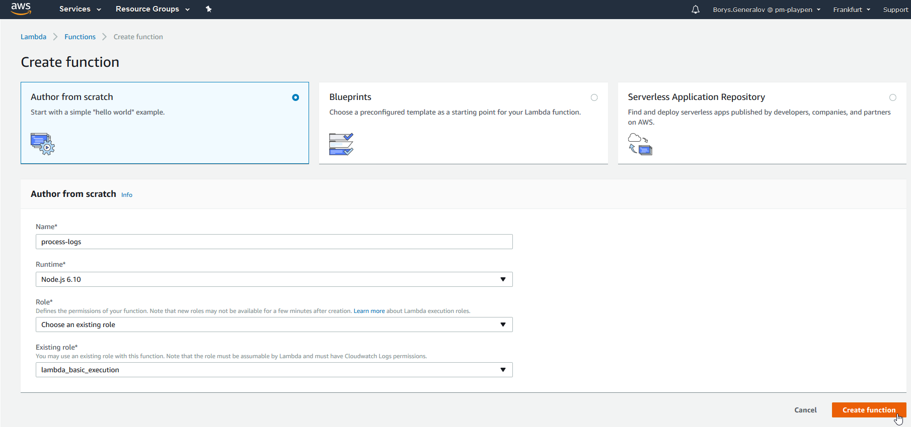
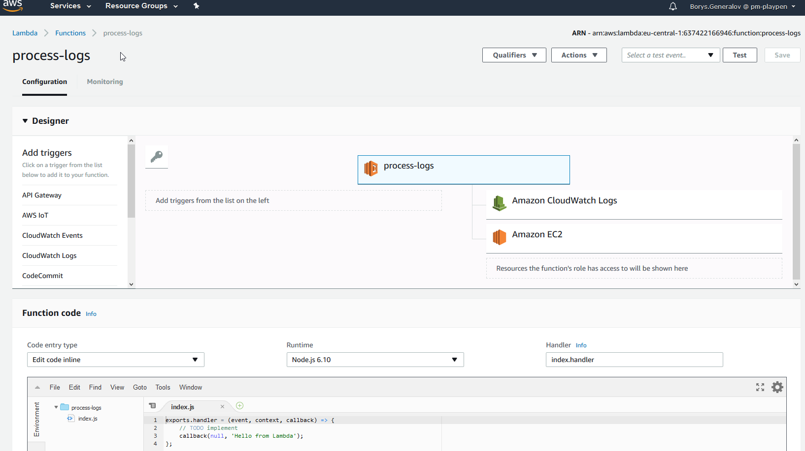

# AWS Lambda

### Key notes

---

## What

---

### What is Lambda

- Serverless from Amazon |
- Lets you run the code written in a "stateless" style |
- Amazon manages the infrastructure on your behalf |
- Code is written in .NET Core, NodeJs, Java, Python or Go |

---

### What can you do with Lambda

In the most basic form lambda is just a single class (C#) or a single function (NodeJs). It can also be an application with external libraries as long as it fits into constraints (up to 50 MB, no more than 5 minutes).

You can invoke Lambda function in response to http events or based on custom schedule. You can not use the lambda for long-running processes, such as video encoding or streaming

---

### What is alternative

- Azure Functions
- Google Cloud Functions
- IBM OpenWhisk Actions
- WebTasks

---

## What is pricing model

The price depends on the amount of requests per month and compute time.

The compute time implies the amount of memory you allocate to  your function and the duration of lambda function execution.

You are charged for the total number of requests, $0.20 per 1M requests.

Duration is metered in increments of 100 milliseconds, rounded up to the nearest 100ms. Price depends on amount of memory allocated for function, e.g. $0.000000208 for 100ms with 128MB RAM and $0.000001667 with 1GB RAM

Free tier icludes 1M requests and 400,000 GB-SECONDS (400,000ms with 1Gb RAM)

---

## Who

---

### Who is using lambda

- Netflix
- National Geographic
- Expedia

---

## How

---

### How to create lambda



---

### How to manage lambda



---

### How it looks in NodeJs

```javascript
'use strict';

module.exports.handler = (event, context, callback) => {
  const response = {
    statusCode: 200,
    body: JSON.stringify({
      message: `Hello, the current time is ${new Date().toTimeString()}.`,
    })
  };

  //signal success
  callback(null, response);

  //signal failure
  callback(`Failed to process request ${event}`);
};
```

@[2,3](Lambda function handler.)
@[4,12](Lambda returns success response (statusCode and body are mandatory.)
@[14,15](Lambda returns failure response. The resulting statusCode will be 502)

---

### How it looks in .NET

```csharp
using Amazon.Lambda.Core;
using System;

[assembly:LambdaSerializer(typeof(Amazon.Lambda.Serialization.Json.JsonSerializer))]

namespace SampleLambdaFunction
{
    public class Handler
    {
       public Response Handle(Request request)
       {
          // do something
          return new Response("Your function executed successfully!");
       }
    }

    public class Request
    {
      public string Key1 {get; set;}

      public Request(string key1){
        Key1 = key1;
      }
    }

    public class Response
    {
      public string Message {get; set;}

      public Response(string message){
        Message = message;
      }
    }
}
```

@[4,5](For any input or output types other than a Stream object, you will need to specify a serializer.)
@[8,16](Lambda function in form of class.)

---

### How it works

---

### How to deploy

---

### How to troubleshoot

---

## But

---

### Cons

- There is no SLA
- What to do when AWS Lambda is down

---

## External references

- https://docs.aws.amazon.com/lambda/latest/dg/current-supported-versions.html

---